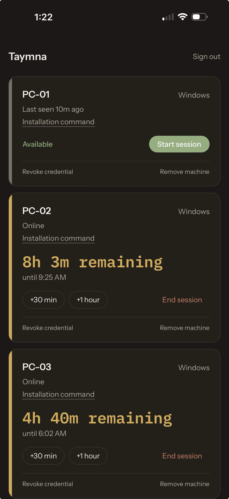

<h1 align="center">Taymna</h1>

<p align="center">
  <strong>Give a computer time. When the time is up, make it unavailable.</strong><br>
  Open-source, self-hosted timed computer control — a dashboard for you, a tiny agent for each machine.
</p>

<p align="center">
  <a href="https://github.com/jaylordibe/taymna/actions/workflows/api-web.yml"></a>
  <a href="https://github.com/jaylordibe/taymna/actions/workflows/agent.yml"></a>
  <a href="https://github.com/jaylordibe/taymna/actions/workflows/install-scripts.yml"></a>
  <a href="https://github.com/jaylordibe/taymna/releases/latest"></a>
  <a href="LICENSE"></a>
</p>

<p align="center">
  <a href="#quick-start">Quick start</a> ·
  <a href="#how-it-works">How it works</a> ·
  <a href="#platform-support">Platform support</a> ·
  <a href="#documentation">Docs</a> ·
  <a href="#development">Development</a>
</p>

---

*Taymna* comes from **"time na"** — Filipino/Cebuano for *"it's time"* / *"time's up."*

You run the server (a laptop on your LAN or a small VPS). Each computer you
want to control runs the agent as a system service. From your phone or
browser you start a session — 30 minutes, 2 hours, whatever — and the
machine is usable until it runs out. No session, no access: the screen is
locked and stays locked.

## Highlights

- **One dashboard, from anywhere** — an installable PWA (phone home screen,
  full-screen) with live countdowns pushed over WebSockets; no polling.
- **Hours per machine, per day or range** — a usage report of the time each
  computer was actually usable (a session ended early counts only up to when
  it ended), broken down by day, drillable to the individual sessions, and
  exportable as CSV.
- **Sessions that actually expire** — the agent stores absolute deadlines,
  guards against clock rollback with a monotonic clock, and locks the
  machine on time **even if the server is unreachable**. Restarting the
  agent never resets the timer.
- **Enforcement, not decoration** — a real OS lock via the platform's own
  mechanism (Windows session lock, `loginctl`, macOS lock), re-asserted
  every ~2 seconds. Not a full-screen web page someone can Alt-Tab past.
- **Nobody gets locked out mid-sentence** — native warnings at 10, 5 and 1
  minute and a final countdown, decided by the agent from the same deadline
  it enforces, so they work offline too. Warning, not negotiation: there is
  no snooze.
- **One-command install** — `irm … | iex` on Windows, `curl … | sudo bash`
  on Linux/macOS: downloads, registers the service, enrolls, starts, and
  verifies the agent connected. Re-running repairs a broken install.
- **Nothing to port-forward on controlled machines** — agents dial *out*
  over WSS with a per-machine credential; the server is the only thing that
  needs to be reachable.
- **Small on purpose** — one domain concept (*Machine → timed Session*),
  three services, Docker Compose. No Redis, no queues, no plugin system.

<p align="center">
  
</p>

## Quick start

**1. Run the server** (Docker Compose):

```bash
git clone https://github.com/jaylordibe/taymna.git
cd taymna
cp .env.example .env
$EDITOR .env          # at minimum: JWT_SECRET, ADMIN_PASSWORD, WEB_ORIGIN, NEXT_PUBLIC_API_URL
docker compose up -d
```

Open the web origin you configured (e.g. `http://192.168.1.50:3001`), sign
in with `ADMIN_EMAIL` / `ADMIN_PASSWORD`, and click **Add machine**.

**2. Install the agent** on the machine to control — the dashboard shows
this command pre-filled with your server address and a one-time token:

```powershell
# Windows — PowerShell run as Administrator
irm https://raw.githubusercontent.com/jaylordibe/taymna/main/install/install.ps1 | iex
```

```bash
# Linux (systemd) or macOS (Apple Silicon)
curl -fsSL https://raw.githubusercontent.com/jaylordibe/taymna/main/install/install.sh | sudo bash
```

**3. Start a session.** The machine shows *Online*, is locked until you
start a session, becomes usable the moment you do, and locks again when
the time runs out.

Putting it on the internet with TLS — including a VPS that already hosts
other apps — is covered step by step in
[docs/deploy-ubuntu-vps.md](docs/deploy-ubuntu-vps.md).

## How it works

```
                    Phone / laptop (browser, installable PWA)
                                      │
                               HTTPS + WSS (JWT)
                                      ▼
        ┌──────────────────────┐            ┌──────────────────────────┐
        │  Web  ·  Next.js     │ ────────── │  API  ·  NestJS + Prisma │ ──── Postgres
        └──────────────────────┘            └────────────┬─────────────┘
                                                         ▲
                             WSS, outbound only, per-machine credential
                        ┌────────────────┬───────────────┴┬────────────────┐
                        │ agent (Windows)│ agent (Linux)  │ agent (macOS)  │
                        │ Windows Service│ systemd        │ launchd        │
                        └────────────────┴────────────────┴────────────────┘
```

| Piece | Stack | Role |
|---|---|---|
| `api/` | NestJS, Prisma, PostgreSQL | Source of truth: machines, sessions, enrollment, the WebSocket protocol |
| `web/` | Next.js, React Query | The dashboard; a PWA that installs to a phone's home screen |
| `agent/` | Rust (tokio, rustls) | One static binary per OS; runs as a system service, enforces locally |

The agent never receives commands — only *facts* about the current session
(`expiresAt`, status). It decides locally, every 2 seconds, whether the
machine should be usable, and — from the same deadline and the same
clock — when to warn the person using it that time is running out. That is
why a dead network or a stopped server can't extend anyone's time, and why
the warnings still arrive when the server is unreachable. Details:
[docs/architecture.md](docs/architecture.md), [docs/protocol.md](docs/protocol.md),
[docs/offline-expiry.md](docs/offline-expiry.md),
[docs/expiry-warnings.md](docs/expiry-warnings.md).

## Platform support

| OS | Runs as | Lock mechanism | Status |
|---|---|---|---|
| **Windows** (x86-64) | Windows Service (LocalSystem) | Locks the console session via `WTSQueryUserToken` + `CreateProcessAsUserW` | ✅ **Verified on real hardware** (Windows 11): locks with no session, re-locks in ~2 s, unlocks on start, locks at expiry |
| **Linux** (x86-64, any distro) | systemd | `loginctl lock-sessions` (systemd-logind) | 🟡 Built as a static binary; decision logic verified live, the lock call itself not yet run against a real desktop |
| **macOS** (Apple Silicon) | launchd | Simulates the system lock shortcut (needs one-time Accessibility permission) | 🟡 Builds and is reviewed; not yet run on a real Mac |

The honest limitation shared by all three: a screen lock can't stop someone
who knows their own OS password from unlocking (Taymna re-locks within ~2 s),
and it doesn't block a fresh login at boot. Exactly what is and isn't
guaranteed per OS: [docs/enforcement.md](docs/enforcement.md).

## Security model, in short

- Operator login → argon2id-hashed password, JWT bearer (no cookies, so no
  CSRF surface).
- Each machine has its own credential, issued once through a single-use,
  15-minute enrollment token, stored hashed, revocable from the dashboard.
  There is no shared secret anywhere.
- The WebSocket protocol has no "run this" message — structurally, the
  server cannot execute anything on a machine.
- Removing a machine is a coordinated hand-off, not a delete: the agent is
  asked to relinquish control and only acknowledges after it has durably
  stopped enforcing, so removal can never strand a locked machine. Breaking
  connectivity never releases enforcement. See
  [Enrollment › Decommissioning](docs/enrollment.md#decommissioning-a-machine).
- Input validation on every route, rate limiting on auth and enrollment,
  CORS locked to the dashboard's origin, secrets redacted from logs.

Full write-up and known limitations: [docs/security.md](docs/security.md).

## Documentation

| | |
|---|---|
| [Self-hosting](docs/self-hosting.md) | Environment variables, first start, upgrading, backups |
| [Deploy on an Ubuntu VPS](docs/deploy-ubuntu-vps.md) | From a blank server to HTTPS — Caddy, nginx, or nginx-in-Docker; shared servers |
| [Agent installation](docs/agent-install.md) | The one-line installers, what they do, manual steps, troubleshooting |
| [Architecture](docs/architecture.md) | The three pieces and why there are only three |
| [Enforcement](docs/enforcement.md) | Per-OS lock mechanism, guarantees, limitations, verification status |
| [Expiry warnings](docs/expiry-warnings.md) | The 10/5/1-minute and final warnings, per-OS behaviour and limits |
| [Usage reports](docs/usage-reports.md) | Hours per machine for a date or range, and what "used" counts as |
| [Offline expiry](docs/offline-expiry.md) | How a session ends on time without a server |
| [Enrollment](docs/enrollment.md) | How a machine gets its credential |
| [Protocol](docs/protocol.md) | Every WebSocket message |
| [Security](docs/security.md) | Threat model, controls, known gaps |

## Development

Each app is self-contained with its own tooling (`yarn` for `api/` and
`web/`, `cargo` for `agent/`).

```bash
# API — needs a local Postgres; api/.env.example expects this one on port 55432
docker run -d --name taymna-dev-postgres -e POSTGRES_USER=taymna -e POSTGRES_PASSWORD=devpassword -e POSTGRES_DB=taymna -p 55432:5432 postgres:17-alpine
cd api && cp .env.example .env && yarn install && yarn db:migrate:dev && yarn start:dev

# Web
cd web && yarn install && yarn dev

# Agent (no service needed for development)
cd agent && cargo run -- enroll --server http://localhost:3000 --token <token> && cargo run
```

| | lint | typecheck | test | build |
|---|---|---|---|---|
| `api/` | `yarn lint` | `yarn typecheck` | `yarn test` · `yarn test:e2e` (real Postgres) | `yarn build` |
| `web/` | `yarn lint` | `yarn typecheck` | `yarn test` | `yarn build` |
| `agent/` | `cargo fmt --check` · `cargo clippy --all-targets -- -D warnings` | — | `cargo test` | `cargo build` |

CI runs all of the above on every push; pushing a `v*.*.*` tag builds the
agent for all three platforms and attaches the binaries to a
[GitHub Release](https://github.com/jaylordibe/taymna/releases).

## Contributing

Issues and PRs are welcome. Before opening one, run the checks above for
whatever you touched. If your change involves the WebSocket protocol, the
session state machine, or platform enforcement, read
[docs/protocol.md](docs/protocol.md), [docs/offline-expiry.md](docs/offline-expiry.md)
and [docs/enforcement.md](docs/enforcement.md) first — they describe
invariants the tests depend on, not style preferences.

## License

[Apache License 2.0](LICENSE)
